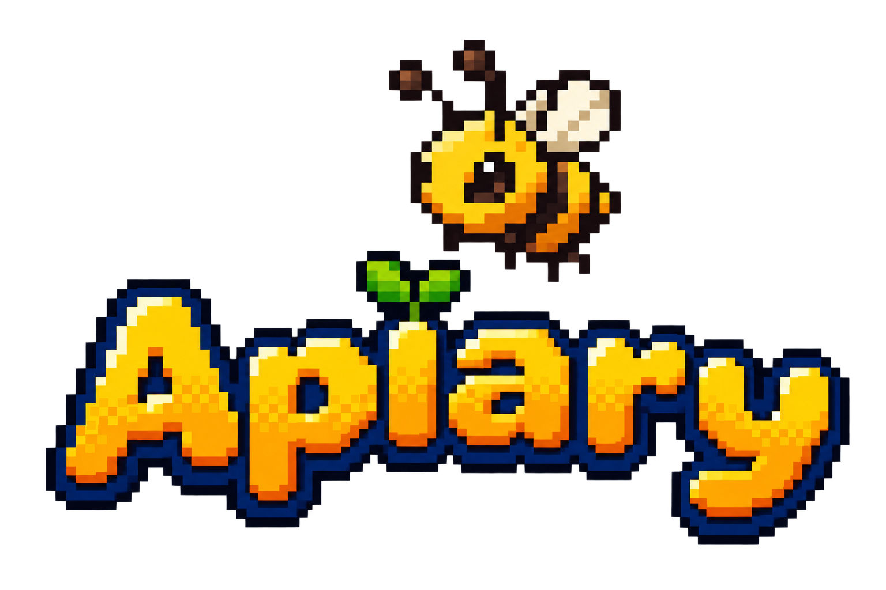
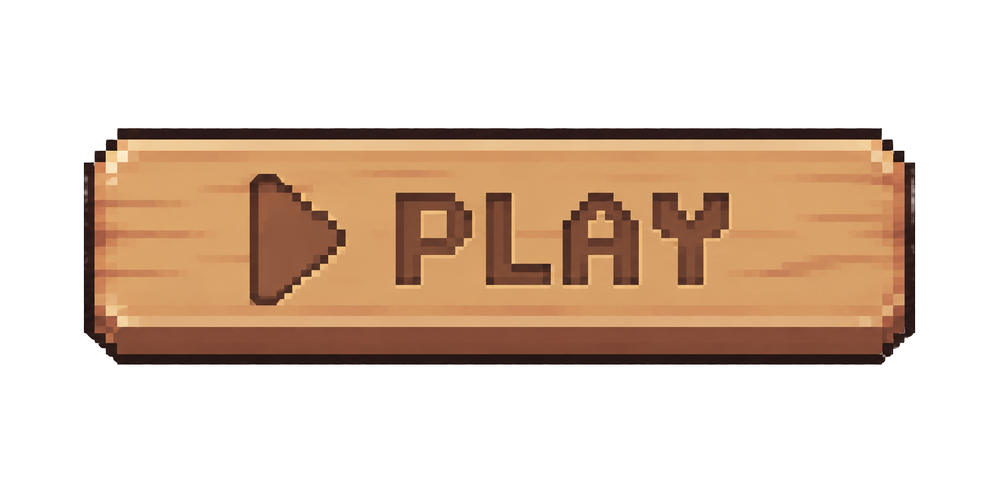
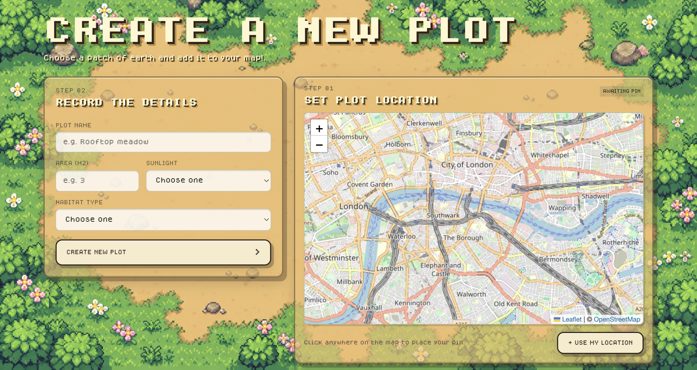
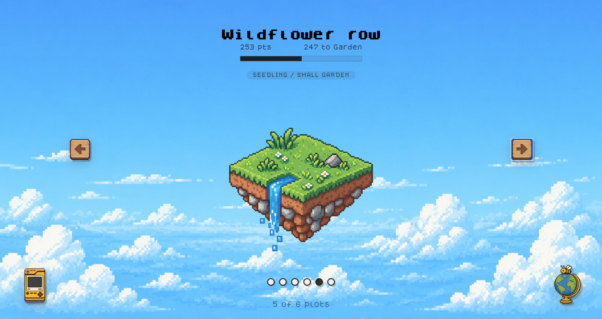
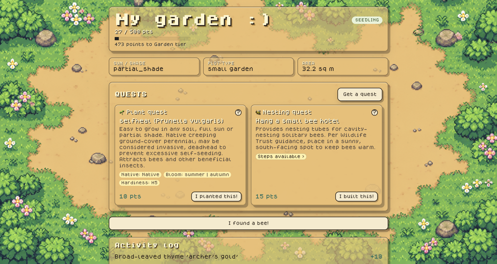
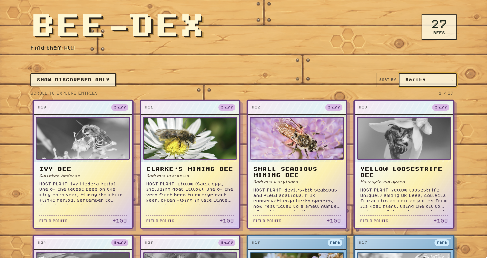
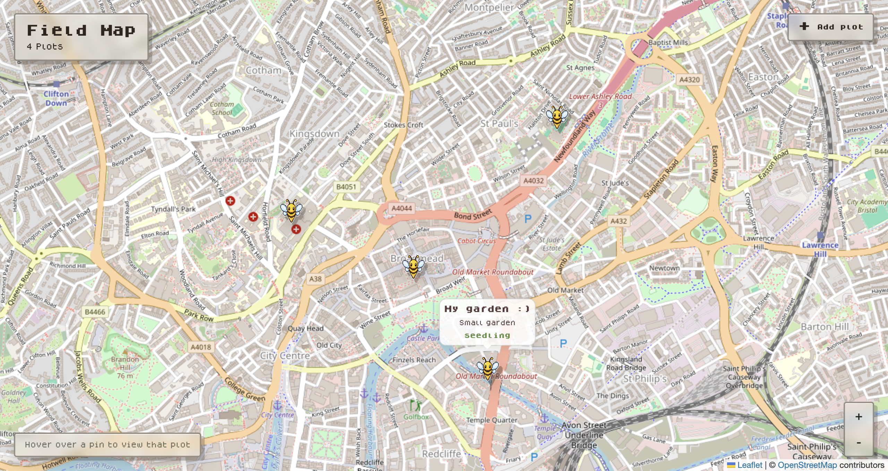

  

<strong><em>Plant something real</em></strong>

<em>Built for AnimalHack 2026</em>

---

## About the name

Yes, an apiary is technically a place for keeping honeybees. Ours doesn't have a single hive in it, on purpose. That's the whole point of the game: most bees don't want a hive. They want a patch of bare soil, the right flowers nearby, and to be left alone. We kept the name anyway, because it's a nicer word than "wild bee habitat tracker."

## The game

You get a plot: a garden, a balcony box, a strip of allotment, whatever ground you've got. From there, it plays out as a loop.

1. **Get a quest.** The app hands you the next useful thing to do on your plot, based on your region, your space, and how far you've come: plant something specific, leave a patch of soil bare, stack up a small brush pile.
2. **Do it for real.** Plant it, leave the soil, build the pile. An actual action in an actual place.
3. **Photograph it.** Proof that it happened, checked automatically by our vision system.
4. **Grow your plot.** Confirmed actions add points, plants and nesting actions each carrying their own value. Enough points moves your plot up a stage: Seedling, Garden, Habitat, Sanctuary. Each stage is a genuinely better patch of ground than the last, not just a bigger number.
5. **Fill in the Bee-dex.** Somewhere along the way, real bees start showing up, because you've built somewhere for them to be. Get a decent photo of one and the app has a go at naming it, then asks you to confirm. Get it right and that species is yours for good. Rarer species score a lot more than common ones, and spotting one you've already logged on the same plot still earns something, just less. The game would rather send you off to plant something for a different bee than have you farm the same sighting twice.

6. **Better with other people around**  Your plot works perfectly well on its own. But it also sits on a shared map alongside everyone else's, where the things people do in their own little corners add up to something bigger: bare soil left, plants added, nesting spaces created, species confirmed, all counted across everyone playing.
You don't need the map for the game to make sense. It's there because a scattered garden here and a balcony box there add up to something worth seeing, and it's nice to know your patch isn't the only one.

Nothing in here is simulated. The plants are real plants. The soil is your actual soil, and the bees, when they turn up, are real bees having a look at what you made.

## Cool features
 
- **No signup.** Open the app and you're already playing. Your plot is tied to your device, not an account you had to make.
- **A shortlist, not a verdict.** When a bee shows up in a photo, the app suggests two or three likely species and asks you to make the final call, instead of pretending to be sure of something it isn't.
- **Every Bee-dex card is a real photograph.** Locked entries aren't just blank. They show up as a shadow of themselves, a hint at what's still out there for you to find.
- **No plot is too small.** Progression is built so even a balcony box can reach Sanctuary tier too, just through a different set of actions than someone with a full garden.
- **Every confirmed sighting becomes real data.** Each one is a checked record: a species, a location, a date. That's the same basic material bee recording schemes like BWARS run on, and every plot playing Apiary adds to it without anyone having to go run a formal survey.

## Why wild bees specifically

Say "bee" to most people and they picture a hive: a queen, worker bees, honey. That's one species. The UK has hundreds more, and almost none of them live anything like that. Most are solitary. No queen, no colony, no honey to speak of. They dig a tunnel in bare ground, or move into a hollow plant stem, or borrow somebody else's empty snail shell, raise their young alone, and get on with it.

They're also carrying more of the pollination workload than people assume. Honeybees kept in managed hives cover only a fraction of UK crop pollination; wild bees and their relatives handle the rest. And they're not doing brilliantly: Britain has lost most of its wildflower meadows since the 1930s, and well over a quarter of British wild bee species are declining over the long term.

None of that needs a grand fix. It mostly needs small, unglamorous things done in lots of gardens at once: a bit of bare soil left alone, the right flower in the right spot, a pile of leaves nobody tidies away. Apiary exists to make those things into a habit.

> *None of this is a UK-only story.* Roughly 40 percent of the world's insect pollinators, bees among them, are considered at risk of extinction, and the decline shows up in bee records pulled from pretty much everywhere researchers have looked, not just the well-studied corners of Europe and North America. We started with the UK because the data existed to build this properly: RHS Plants for Pollinators and BWARS give detailed, evidence-based lists of which plants actually help which bees, region by region, and that combination is hard to find anywhere else in one place. Swap in a different region's list of pollinator-friendly plants and local bee species, and the same plot and quest logic runs there too. The UK is just where we started.

## Screenshots

### Plot Creator

### Plot carousel

### Plot progression

### Bee-dex

### Field Map

 
## Privacy and Storage
> Photos you submit specifically to the sightings, i.e, the bee photos, are stored, along with the location and time attached to them, into the private shared dataset described above. All photos are also sent to Google's Gemini API for species identification. No account, email, or name is ever attached to any of it, only a user ID.
 
**Live demo:** [Try it out here](https://apiary-ochre.vercel.app/)

## How it's built 

| Area         | Technology / Approach  |
| ------------ | -------------------------------------------------------------------------------------- |
| **Frontend** | React (Vite, JavaScript), React Router DOM v7, Axios, and React Leaflet with Leaflet.js for the field map. |
| **Backend**  | FastAPI with PostgreSQL via SQLALchemy         |
| **Identity** | No auth. The client generates a UUID with `crypto.randomUUID()` on first load, persists it in `localStorage`, and attaches it as an `X-User-ID` header via an Axios request interceptor. Authenticated endpoints resolve the user through a `get_current_user_id` dependency.                   |
| **Vision**   | Two-tier LLM vision pipeline. Tier one verifies that a submitted photo plausibly matches the claimed planting or nesting action. Tier two handles species ID on sighting photos, returning the top 2–3 candidates for user confirmation rather than making a single automated call.             |
| **Data**     | `plants` (RHS Plants for Pollinators IDs and hardiness ratings, ~53 rows), `species` (30 UK wild bee species and rarity tiers), `nesting_actions`, and a `plant_species` junction table. Region bucketing uses latitude bands mapped to USDA hardiness zone equivalents, with no geocoding API. |

*For more details, check out [ARCHITECTURE.md](ARCHITECTURE.md).*

